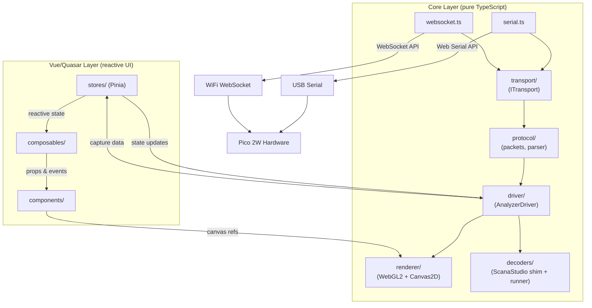
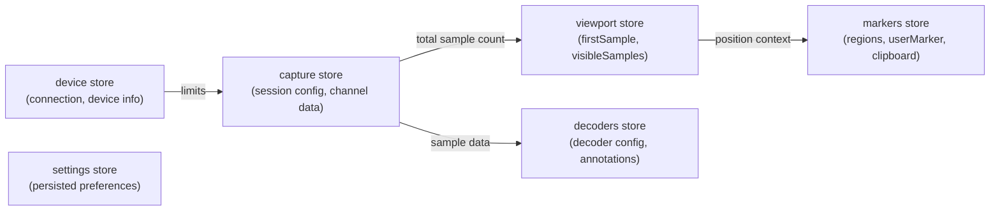
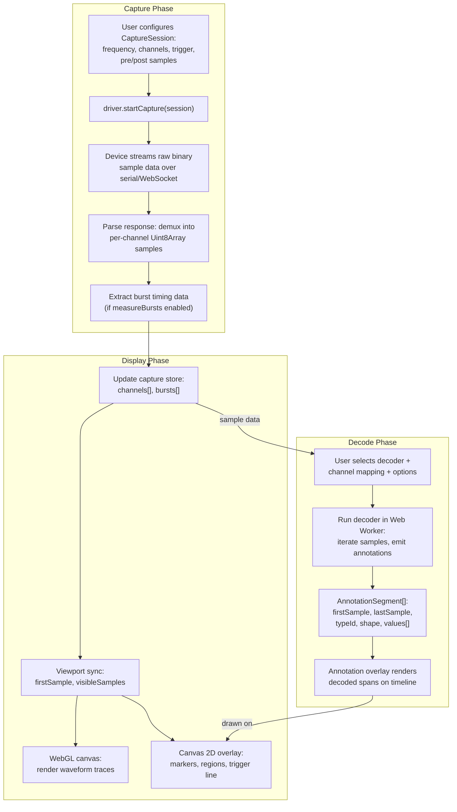
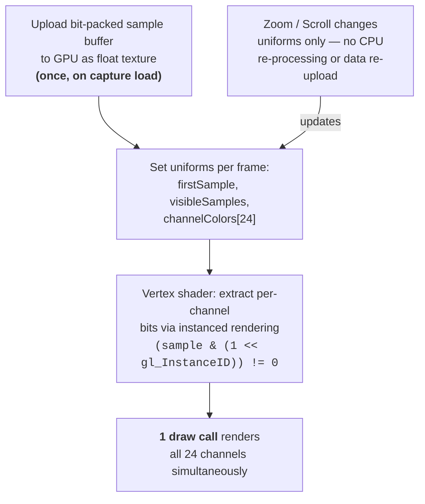
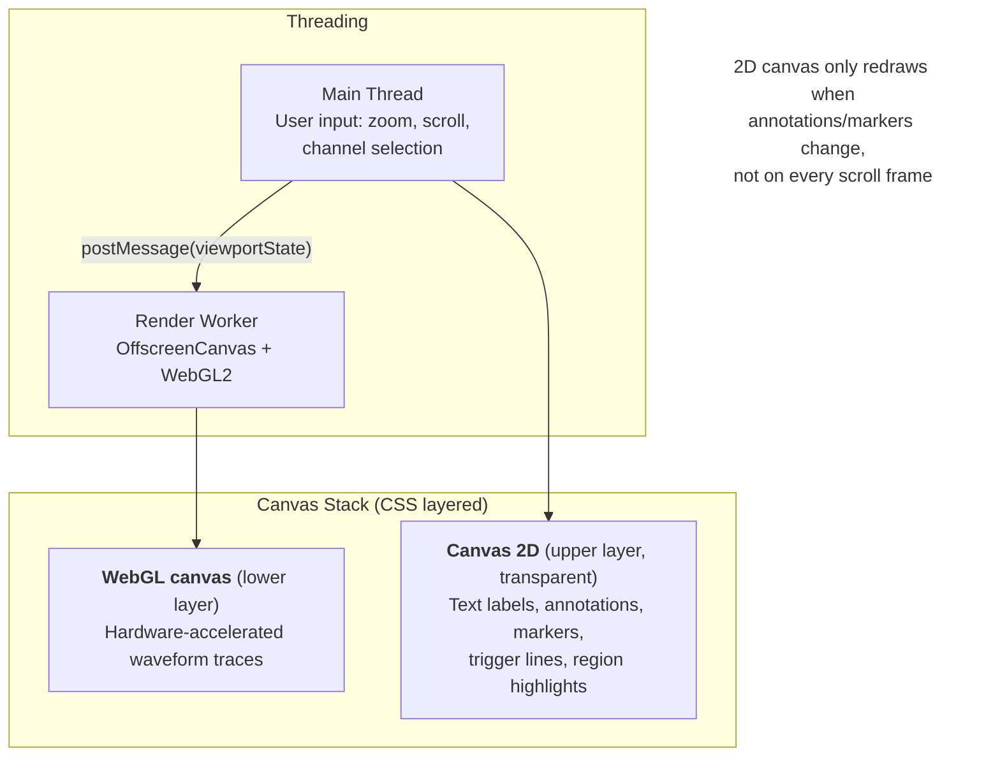
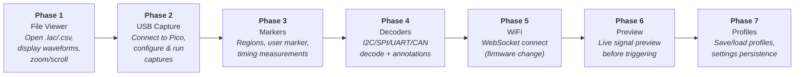

# LogicAnalyzer Web Port — Architecture Design

## Overview

A web-based port of the LogicAnalyzer desktop application (Avalonia/.NET) to a browser-based app using **Quasar Framework** (Vue 3 + TypeScript). The web app connects directly to the Pico 2W hardware via **Web Serial API** (USB) and **WebSocket** (WiFi), with no backend server required.

**Target browser:** Chrome/Edge (desktop) — Web Serial API is Chromium-only.

## Design Principle: Core Logic is Framework-Agnostic

All protocol, driver, and rendering logic lives in a **pure TypeScript `core/` layer** with zero Vue/Quasar imports. The Vue layer (`stores/`, `composables/`, `components/`) is a thin integration shell. This means:

- Core logic is testable without a browser/DOM
- The rendering engine can be swapped without touching protocol code
- Features can be ported one at a time — each `core/` module works independently

---

## Project Structure

```
src/
├── core/                         # Pure TypeScript — NO Vue/Quasar imports
│   ├── transport/                # Raw byte communication
│   │   ├── types.ts              #   ITransport interface (connect, read, write, close)
│   │   ├── serial.ts             #   Web Serial API implementation
│   │   └── websocket.ts          #   WebSocket implementation (for WiFi)
│   │
│   ├── protocol/                 # Device protocol (byte-stuffing, framing)
│   │   ├── packets.ts            #   OutputPacket serialize/deserialize, byte stuffing
│   │   ├── commands.ts           #   Command constants (0x00=init, 0x01=capture, etc.)
│   │   └── parser.ts             #   Response parser (text lines + binary packets)
│   │
│   ├── driver/                   # High-level device driver (mirrors SharedDriver)
│   │   ├── types.ts              #   DeviceInfo, CaptureSession, CaptureMode,
│   │   │                         #   TriggerType, CaptureLimits, BurstInfo, etc.
│   │   ├── analyzer.ts           #   AnalyzerDriver class (connect, capture, preview)
│   │   └── samples.ts            #   ExtractSamples (demux UInt32[] -> per-channel byte[])
│   │
│   ├── capture/                  # Capture data model & serialization
│   │   ├── types.ts              #   AnalyzerChannel, SampleRegion
│   │   ├── formats.ts            #   .lac (JSON) and .csv read/write
│   │   └── editing.ts            #   Cut/copy/paste/insert/delete/shift operations
│   │
│   ├── decoders/                 # Protocol decoder engine
│   │   ├── types.ts              #   DecoderInfo, DecoderChannel, DecoderOption,
│   │   │                         #   Annotation, AnnotationSegment
│   │   ├── registry.ts           #   Decoder discovery and listing
│   │   ├── shim.ts               #   ScanaStudio API compatibility layer
│   │   └── runner.ts             #   Execute decoder, collect annotations
│   │
│   └── renderer/                 # WebGL2 rendering engine
│       ├── types.ts              #   Viewport, RenderState, ChannelStyle
│       ├── waveform-renderer.ts  #   WebGL2 instanced rendering of channel traces
│       ├── annotation-renderer.ts#   Canvas 2D overlay for decoder annotations
│       ├── marker-renderer.ts    #   Trigger line, user marker, region highlights
│       └── shaders/              #   GLSL vertex/fragment shaders
│           ├── waveform.vert.glsl
│           └── waveform.frag.glsl
│
├── workers/                      # Web Workers (off main thread)
│   ├── capture.worker.ts         #   Binary capture data processing & sample extraction
│   └── decoder.worker.ts         #   Protocol decoder execution (JS decoders + Pyodide)
│
├── stores/                       # Pinia stores (reactive state)
│   ├── device.ts                 #   Connection state, device info, connected/disconnected
│   ├── capture.ts                #   CaptureSession config, channel data, burst info
│   ├── viewport.ts               #   FirstSample, VisibleSamples, zoom level
│   ├── markers.ts                #   UserMarker, SampleRegions[], clipboard
│   ├── decoders.ts               #   Selected decoder, options, annotation results
│   └── settings.ts               #   Persisted preferences (localStorage/IndexedDB)
│
├── composables/                  # Vue composables (bridge core <-> Vue)
│   ├── useDevice.ts              #   connect(), disconnect(), deviceInfo, isConnected
│   ├── useCapture.ts             #   startCapture(), stopCapture(), repeatCapture()
│   ├── useViewport.ts            #   zoom, scroll, sync across display components
│   ├── useRenderer.ts            #   binds WebGL canvas + annotation canvas to stores
│   ├── useMarkers.ts             #   region CRUD, user marker, measurements
│   ├── useDecoders.ts            #   decoder list, configure, run analysis
│   ├── useFileIO.ts              #   open/save .lac/.csv via browser-fs-access
│   └── usePreview.ts             #   realtime preview start/stop/data stream
│
├── components/                   # Quasar/Vue UI components
│   ├── connection/
│   │   ├── ConnectionPanel.vue   #   Connect button, device picker, device info display
│   │   └── NetworkConfigDialog.vue
│   │
│   ├── capture/
│   │   ├── CapturePanel.vue      #   Frequency, pre/post samples, trigger config
│   │   ├── TriggerConfig.vue     #   Trigger type selector + pattern editor
│   │   └── CaptureToolbar.vue    #   Capture / Stop / Repeat buttons
│   │
│   ├── viewer/
│   │   ├── WaveformCanvas.vue    #   WebGL canvas wrapper (uses useRenderer)
│   │   ├── AnnotationOverlay.vue #   2D canvas overlay for decoder output
│   │   ├── MarkerOverlay.vue     #   Trigger line, regions, user marker
│   │   ├── TimelineRuler.vue     #   Sample position ruler with zoom
│   │   └── SamplePreviewer.vue   #   Minimap/thumbnail with viewport indicator
│   │
│   ├── channels/
│   │   ├── ChannelList.vue       #   Channel name, color, visibility toggles
│   │   └── ChannelSelector.vue   #   Multi-select for capture config
│   │
│   ├── decoders/
│   │   ├── DecoderPanel.vue      #   Decoder selection + channel mapping
│   │   ├── DecoderOptions.vue    #   Type-safe option controls
│   │   └── DecoderResults.vue    #   Annotation list/table view
│   │
│   └── common/
│       ├── MeasurePanel.vue      #   Timing measurements for selected range
│       └── BurstTable.vue        #   Burst timing results
│
├── layouts/
│   └── MainLayout.vue            #   App shell: toolbar + drawer + main area
│
├── pages/
│   └── IndexPage.vue             #   Single page — wires together all panels
│
├── boot/
│   └── webserial.ts              #   Check Web Serial API availability, warn if missing
│
└── assets/
    └── ...
```

---

## Data Flow Architecture



### Store Dependency Graph



---

## Key Interface Contracts

### Transport Layer

```typescript
// core/transport/types.ts — The foundation everything builds on

interface ITransport {
  connect(): Promise<void>
  disconnect(): Promise<void>
  readonly connected: boolean

  // Raw byte I/O — matches what the protocol layer needs
  write(data: Uint8Array): Promise<void>
  readLine(): Promise<string> // For text handshake phase
  readBytes(count: number): Promise<Uint8Array> // For binary phase
  readUntilIdle(timeoutMs: number): Promise<Uint8Array> // For capture dumps

  onDisconnect: (() => void) | null
}
```

### Driver Types

```typescript
// core/driver/types.ts — Mirrors C# CaptureSession exactly

enum TriggerType {
  Edge = 0,
  Complex = 1,
  Fast = 2,
  Blast = 3,
}

enum CaptureMode {
  Channels_8 = 0,
  Channels_16 = 1,
  Channels_24 = 2,
}

enum CaptureError {
  None = 0,
  Busy = 1,
  BadParams = 2,
  HardwareError = 3,
  UnexpectedError = 4,
}

interface DeviceInfo {
  version: string
  maxFrequency: number
  blastFrequency: number
  channels: number
  bufferSize: number
  modeLimits: CaptureLimits[]
}

interface CaptureLimits {
  minPreSamples: number
  maxPreSamples: number
  minPostSamples: number
  maxPostSamples: number
  maxTotalSamples: number // computed: maxPreSamples + maxPostSamples
}

interface CaptureSession {
  frequency: number
  preTriggerSamples: number
  postTriggerSamples: number
  triggerType: TriggerType
  triggerChannel: number
  triggerPattern: number
  triggerBitCount: number
  captureChannels: AnalyzerChannel[]
  loopCount: number
  measureBursts: boolean
  bursts?: BurstInfo[]
}

interface BurstInfo {
  sampleIndex: number
  gapSamples: number
  gapTime: number // seconds
}
```

### Capture Data Model

```typescript
// core/capture/types.ts

interface AnalyzerChannel {
  channelNumber: number
  channelName: string
  channelColor: string // hex color
  visible: boolean
  samples: Uint8Array // 0=low, 1=high per sample
}

interface SampleRegion {
  firstSample: number
  lastSample: number
  regionName: string
  regionColor: string
}
```

### Renderer Types

```typescript
// core/renderer/types.ts — What the rendering engine needs

interface Viewport {
  firstSample: number
  visibleSamples: number
}

interface RenderState {
  channels: AnalyzerChannel[]
  viewport: Viewport
  preTriggerSamples: number
  regions: SampleRegion[]
  userMarker: number | null
  annotations: Annotation[]
}
```

### Decoder Contract

```typescript
// core/decoders/types.ts — Universal decoder contract

interface DecoderChannel {
  id: string
  name: string
  description: string
  required: boolean
}

interface DecoderOption {
  id: string
  caption: string
  type: 'boolean' | 'integer' | 'double' | 'string' | 'list'
  listValues?: string[]
  min?: number
  max?: number
  defaultValue?: unknown
}

interface AnnotationSegment {
  typeId: number
  shape: 'rect' | 'roundRect' | 'hexagon' | 'circle'
  firstSample: number
  lastSample: number
  values: string[] // [0]=short, [1]=medium, [2]=long form
}

interface Annotation {
  name: string
  segments: AnnotationSegment[]
}

interface IDecoder {
  readonly id: string
  readonly name: string
  readonly shortName: string
  readonly categories: string[]
  readonly channels: DecoderChannel[]
  readonly options: DecoderOption[]

  decode(
    sampleRate: number,
    channelData: Map<number, Uint8Array>,
    options: Map<string, unknown>,
  ): AnnotationSegment[]
}
```

---

## Pinia Store Separation

The stores mirror the feature groups from the desktop app but are properly decoupled:

| Store      | Owns                                               | Reads from              |
| ---------- | -------------------------------------------------- | ----------------------- |
| `device`   | connection state, device info, driver instance ref | —                       |
| `capture`  | session config, channel data, burst info           | `device` (limits)       |
| `viewport` | firstSample, visibleSamples, zoom level            | `capture` (total count) |
| `markers`  | regions[], userMarker, clipboard                   | `viewport` (position)   |
| `decoders` | selected decoder, options, annotation results      | `capture` (sample data) |
| `settings` | persisted prefs (last config, channel colors)      | —                       |

Each store is independently testable and only talks to other stores through Pinia's standard reactive reads — no circular dependencies.

---

## Communication Details

### USB Serial (Web Serial API)

The Web Serial API maps almost 1:1 to the existing `SharedDriver/LogicAnalyzerDriver.cs`:

| Desktop (C#)               | Web (JS)                                                                    |
| -------------------------- | --------------------------------------------------------------------------- |
| `SerialPort(port, 115200)` | `port.open({ baudRate: 115200, bufferSize: 1048576 })`                      |
| VID:1209 / PID:3020 filter | `requestPort({ filters: [{ usbVendorId: 0x1209, usbProductId: 0x3020 }] })` |
| `sp.RtsEnable = true`      | `port.setSignals({ requestToSend: true })`                                  |
| `readResponse.ReadLine()`  | `TransformStream` line buffer (~30 lines of JS)                             |
| `readData.ReadBytes(n)`    | `reader.read()` accumulate into `Uint8Array`                                |
| `OutputPacket.Serialize()` | Port byte-stuffing logic to JS (~50 lines)                                  |

**Key gotcha:** The default Web Serial `bufferSize` is 255 bytes. Must be set to 1MB+ (`1048576`) or capture data will overflow.

**Permission model:** User selects the device once via a browser picker (triggered by a button click). `navigator.serial.getPorts()` auto-reconnects on subsequent visits without prompting.

**Browser support:** Chrome/Edge only. Firefox and Safari have explicitly refused to implement Web Serial.

### WiFi (WebSocket — requires firmware change)

Browsers cannot open raw TCP sockets. The Pico firmware needs a WebSocket server added. The existing byte-stuffed binary protocol travels **unchanged** inside WebSocket binary frames — no protocol redesign needed.

**Firmware library options:**

- **Mongoose** — commercial-grade, GPL, official Pico W tutorial, recommended
- **pico-ws-server** — lightweight, lwIP-based, C SDK native

**Browser side:**

```javascript
const ws = new WebSocket('ws://192.168.1.100:8080')
ws.binaryType = 'arraybuffer'
```

**Security note:** Chrome 142+ shows a one-time "Local Network Access" permission prompt when an HTTPS-hosted page connects to a local IP. Serving from `localhost` avoids this.

### Capture → Display → Decode Data Flow



### Protocol Details (shared between USB and WiFi)

**Initialization handshake (text-based):**

1. Client sends sync bytes `[0x55, 0xAA]` followed by command byte `0x00`
2. Device responds with version string (e.g., `"ANALYZER_V5_1"`)
3. Device sends capability lines: `CHANNELS:24`, `BUFFER:262144`, `FREQ:100000000`, `BLASTFREQ:200000000`

**Binary packet format (OutputPacket):**

- Frame: `[0x55 0xAA] [payload] [0xAA 0x55]`
- Byte stuffing: bytes `0xAA`, `0x55`, `0xF0` are escaped with `0xF0` prefix and XORed with `0xF0`
- First payload byte = command ID (0 = init, 1 = capture, 2+ = preview/config)

**Capture modes:**

- 8-channel: 1 byte per sample
- 16-channel: 2 bytes per sample
- 24-channel: 4 bytes per sample (upper byte unused)

---

## Rendering Strategy

### Why WebGL2

| Renderer  | 100k elements | 500k elements |
| --------- | ------------- | ------------- |
| SVG       | unusable      | —             |
| Canvas 2D | 40 fps        | unusable      |
| WebGL2    | 60 fps        | 55 fps        |

At maximum zoom (10,000 visible samples x 24 channels = 240k draw ops/frame), only WebGL2 maintains interactive frame rates.

### Rendering Pipeline



### Two-Canvas Architecture



---

## Protocol Decoder Strategy

### Primary Path: ScanaStudio JS Decoders

35 open-source JavaScript protocol decoders from [ikalogic/ScanaStudio-Decoders](https://github.com/ikalogic/ScanaStudio-Decoders) covering I2C, SPI, UART, CAN, LIN, JTAG, 1-Wire, USB 1.1, Manchester, PWM, and more.

Requires a ~300-line TypeScript shim implementing the ScanaStudio API:

**Input API (shim provides):**

```typescript
trs_get_first(ch) // first transition on channel
trs_get_next(ch) // next transition
trs_is_not_last(ch) // check if more transitions
bit_sampler_ini(ch, offset, period) // initialize bit sampling
bit_sampler_next(ch) // sample next bit
get_sample_rate() // returns sample rate in Hz
```

**Output API (shim collects):**

```typescript
dec_item_new(ch, start, end) // create annotated span
dec_item_add_pre_text(text) // display label
dec_item_add_comment(text) // tooltip text
dec_item_add_data(value) // decoded value
pkt_start(name) / pkt_end() // packet boundaries
hex_add_byte(ch, start, end, value) // hex view entry
```

**Advantages:** Zero startup overhead, native JS performance, no Python runtime download.

### Fallback Path: Pyodide + pysigrok (for rare decoders)

For exotic protocols not covered by ScanaStudio decoders:

- **pysigrok** is a pure-Python reimplementation of sigrok with 100+ decoders
- **Pyodide** runs CPython compiled to WASM in the browser
- Load lazily in a Web Worker only when user requests an uncommon decoder
- 10-20 MB download on first use, cache via service worker
- Performance: 2-10x slower than native CPython, but 262k samples should decode in <10 seconds in a background thread

**Risk:** Needs verification that `micropip.install('pysigrok-libsigrokdecode')` succeeds (may lack WASM-compatible wheels).

---

## File I/O

### Formats

- **`.lac`** — JSON-based LogicAnalyzer capture format (settings + samples). Trivially parseable in the browser.
- **`.csv`** — CSV export with channels as columns, one row per sample.

### Library

Use [browser-fs-access](https://github.com/GoogleChromeLabs/browser-fs-access) (by Google Chrome Labs):

- Uses File System Access API on Chrome/Edge (native save dialog)
- Falls back to `<input type="file">` / `<a download>` on Firefox/Safari
- API: `fileOpen()`, `fileSave()` — same call regardless of browser

### Approaches

1. **Primary file open:** drag-and-drop (universal)
2. **Secondary:** `fileOpen()` picker dialog (universal)
3. **Save:** `fileSave()` (native save-in-place on Chrome/Edge, download dialog on Firefox/Safari)

---

## Persistence (Settings)

The desktop app stores settings in `%APPDATA%/LogicAnalyzer/` as JSON files. The web port uses:

| Desktop file            | Web equivalent               |
| ----------------------- | ---------------------------- |
| `cpSettings{type}.json` | `localStorage` (small JSON)  |
| `profiles.json`         | `IndexedDB` (larger data)    |
| `knownDevices.json`     | Not needed (no multi-device) |
| Window position/size    | Not applicable               |

The `settings` Pinia store handles serialization to/from `localStorage` with a `watch()` for automatic persistence.

---

## Phased Porting Plan

Each phase delivers a **usable, shippable feature increment:**



| Phase                        | Delivers                                                 | Core modules                                 | Components                                          |
| ---------------------------- | -------------------------------------------------------- | -------------------------------------------- | --------------------------------------------------- |
| **1. File viewer**           | Open .lac/.csv files, display waveforms, zoom/scroll     | `capture/formats`, `renderer/*`              | `WaveformCanvas`, `TimelineRuler`, `ChannelList`    |
| **2. USB capture**           | Connect to Pico via USB, configure & run captures        | `transport/serial`, `protocol/*`, `driver/*` | `ConnectionPanel`, `CapturePanel`, `CaptureToolbar` |
| **3. Markers & measurement** | Regions, user marker, timing measurements                | `capture/editing`                            | `MarkerOverlay`, `MeasurePanel`                     |
| **4. Protocol decoders**     | I2C/SPI/UART/CAN decode + annotation display             | `decoders/*`, `workers/decoder`              | `DecoderPanel`, `AnnotationOverlay`                 |
| **5. WiFi connectivity**     | Connect via WebSocket (requires firmware change)         | `transport/websocket`                        | `NetworkConfigDialog`                               |
| **6. Realtime preview**      | Live signal preview before triggering                    | extend `driver/analyzer`                     | `SamplePreviewer`                                   |
| **7. Profiles & polish**     | Save/load capture+decoder profiles, settings persistence | `settings` store expansion                   | Profile management UI                               |

**Phase 1 is the critical proof-of-concept** — it requires no hardware at all. Anyone can open an existing `.lac` file in Chrome and view waveforms. This validates the rendering engine and the basic UI shell before touching any device communication code.

---

## Why This Structure Works for Incremental Porting

1. **`core/` has no framework dependency** — you can write and unit-test the protocol parser, byte-stuffing, sample extraction, and decoder shim with plain `vitest` before building any UI
2. **Each `core/` module has a single concern** — `transport/` doesn't know about captures, `protocol/` doesn't know about rendering
3. **Composables bridge the gap** — `useCapture()` wires the `capture` store to `core/driver/analyzer.ts` and exposes reactive state. Components never import from `core/` directly
4. **Workers are optional accelerators** — the decoder can run on the main thread first, then be moved to a Web Worker when performance matters. The `IDecoder` interface doesn't change
5. **The renderer is a standalone class** — `WaveformCanvas.vue` just passes a `<canvas>` ref to `core/renderer/waveform-renderer.ts`. Replacing WebGL2 with WebGPU later means swapping one file

---

## Reference: Desktop C# Source Files

These are the source files in the existing desktop app that each web module maps to:

| Web module        | Desktop source                                                                         |
| ----------------- | -------------------------------------------------------------------------------------- |
| `core/transport/` | `SharedDriver/LogicAnalyzerDriver.cs` (serial/network connection logic)                |
| `core/protocol/`  | `SharedDriver/LogicAnalyzerDriver.cs` (OutputPacket, ReadCapture, byte stuffing)       |
| `core/driver/`    | `SharedDriver/AnalyzerDriverBase.cs`, `LogicAnalyzerDriver.cs`, `CaptureSession.cs`    |
| `core/capture/`   | `SharedDriver/AnalyzerChannel.cs`, `LogicAnalyzer/Classes/ExportedCapture.cs`          |
| `core/decoders/`  | `LogicAnalyzer/SigrokDecoderBridge/SigrokDecoderBase.cs`, `SigrokProvider.cs`          |
| `core/renderer/`  | `LogicAnalyzer/Controls/SampleViewer.axaml.cs`                                         |
| `stores/device`   | `LogicAnalyzer/MainWindow.axaml.cs` (driver field, connection state)                   |
| `stores/capture`  | `LogicAnalyzer/MainWindow.axaml.cs` (session field, channel data)                      |
| `stores/viewport` | `LogicAnalyzer/MainWindow.axaml.cs` (FirstSample, VisibleSamples, ISampleDisplay sync) |
| `stores/markers`  | `LogicAnalyzer/Controls/SampleMarker.axaml.cs` (regions, user marker, clipboard)       |
| `stores/settings` | `LogicAnalyzer/Classes/AppSettingsManager.cs`                                          |
